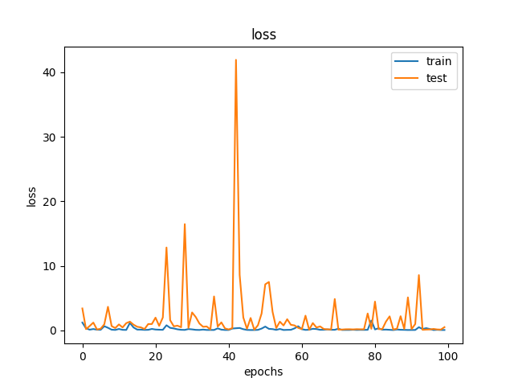
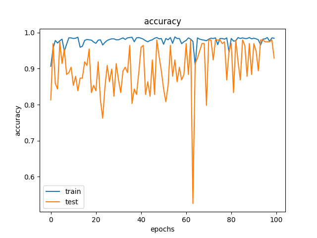
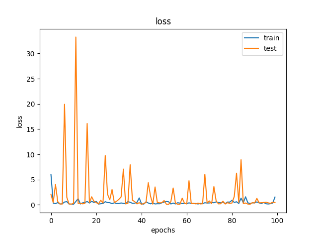
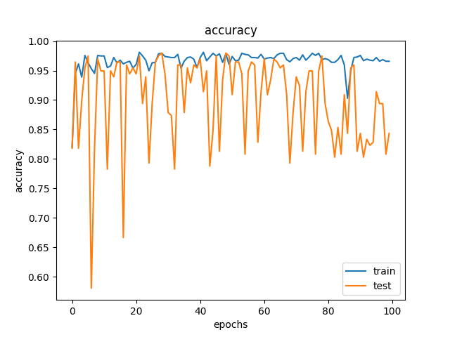
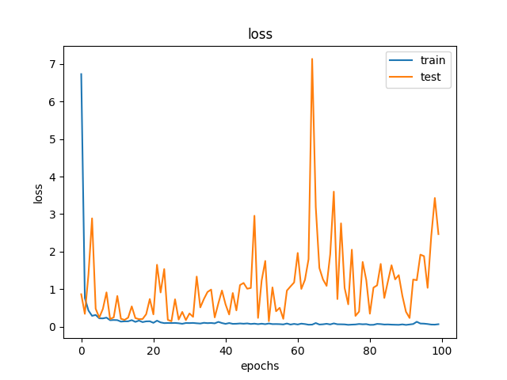
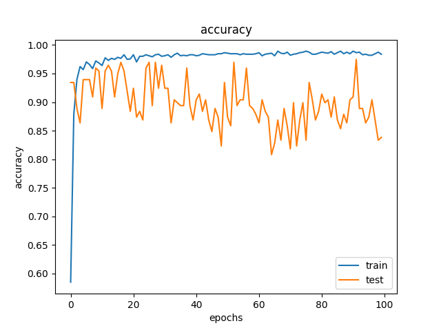

# CPSC 8650 Data Mining Group Project

This project aims to identify whether brain scans done by MRIs have facial features that could potentially be used to identify the patient. We are developing a tool that takes in images and will print out if it has potentially personally identifiable information.

## Our Data

Our dataset comes from Dr. Zijun Wang's research group. Using the BET and BSE tools, they produced labeled MRI images of if the image had identifiable facial features or brain tissue removed. All credit for the data goes to them. The .zip file for the data is too large to host on Github, but the link is below. 

[Our Data](https://dyslexia.computing.clemson.edu/BET_BSE/)

Trying to run this model will assume that you have unzipped the original zip file, as well as all of the `.gz` files for the `.nii` data

This helps us save on time spent by the script

## Our Results

### First Iteration

Our first iteration of our model is shown in `modelTeam11v1.py`. Here are the charts from training:

### Second Iteration

Our second iteration is in the file `modelTeam11v2.py` and adds in Dropout layers.

### Third Iteration

Our third iteration is in the file `modelTeam11v3.py` and changes the hyperparameters used.

